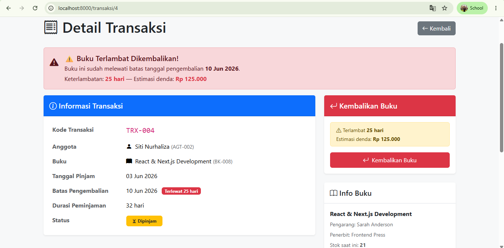
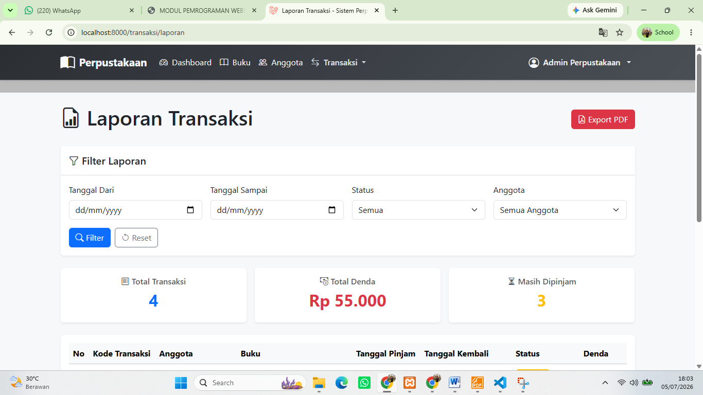
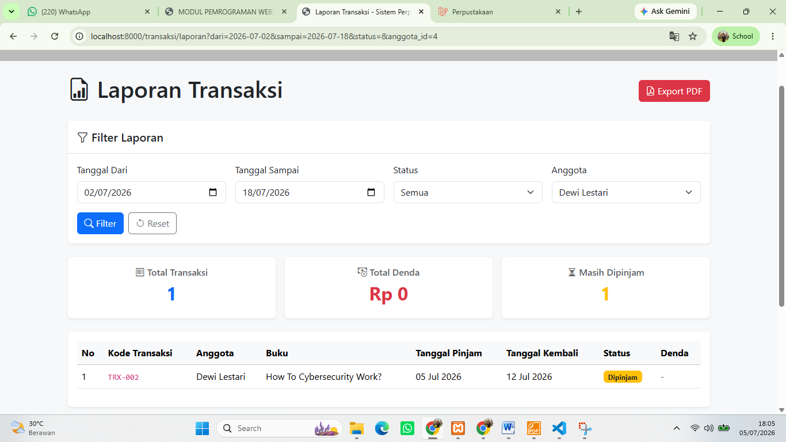
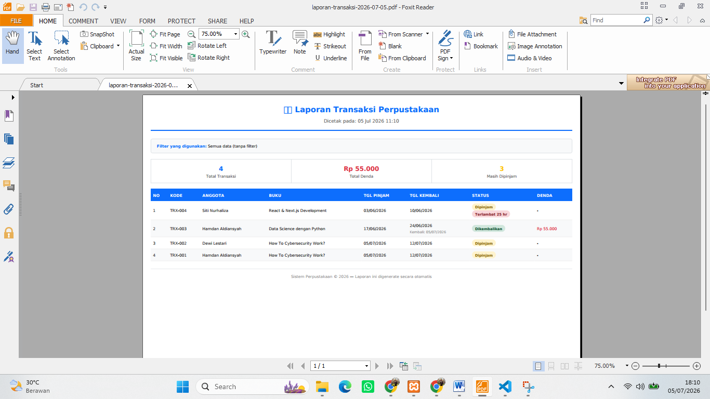
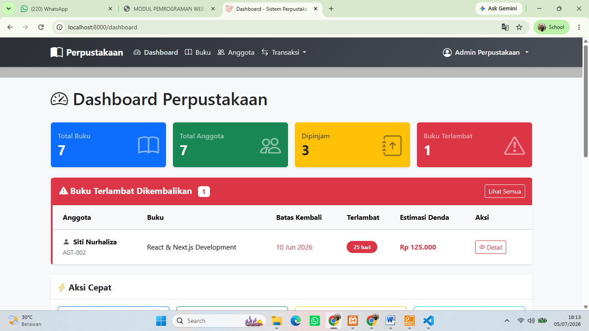

# Pertemuan 14 - Pemrograman Web II

## Identitas

- **Nama:** M. Hamdan Aldiansyah
- **NIM:** 60324080
- **Mata Kuliah:** Pemrograman Web II
- **Pertemuan:** 14

---

## Fitur yang Diimplementasikan

### ✅ 1. Pengembalian Buku

- Tombol Kembalikan Buku
- Perhitungan denda Rp5.000/hari
- Update stok buku otomatis

---

### ✅ 2. Laporan Transaksi

- Filter tanggal
- Filter status
- Filter anggota
- Export PDF

---

### ✅ 3. Notifikasi Keterlambatan

- Dashboard menampilkan buku terlambat
- Badge keterlambatan pada transaksi
- Warning pada detail transaksi

